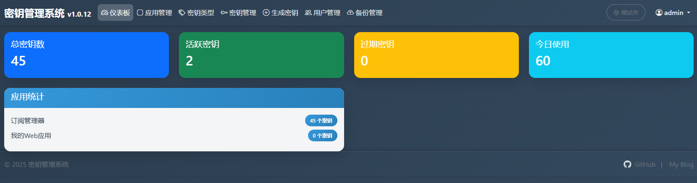
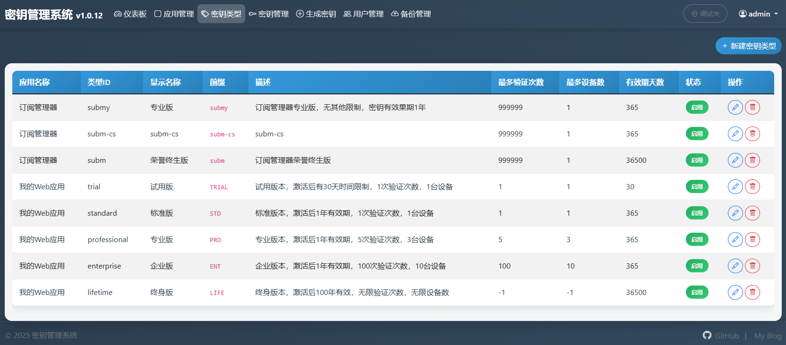
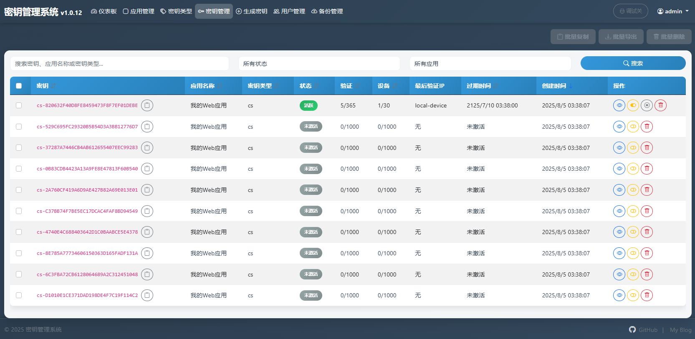
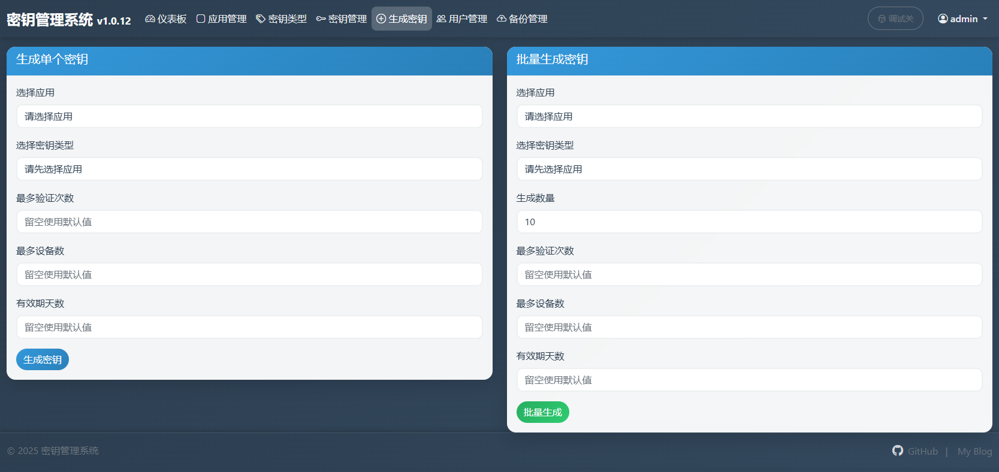
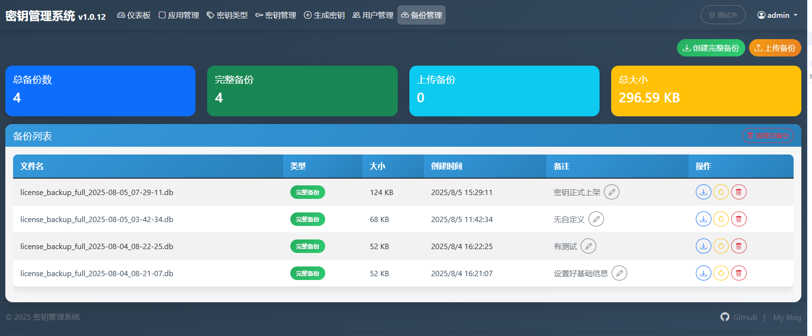

# 密钥管理系统 (License Management System)

> 现代化License管理系统，支持密钥生成、验证、设备管理等功能

[](https://nodejs.org/)
[](https://expressjs.com/)
[](https://www.sqlite.org/)
[](https://github.com/vbskycn/License/blob/main/LICENSE)







## 系统特性





## 📚 文档导航

本系统提供完整的技术文档，按照不同用户角色进行分类：

### 📖 用户指南
面向最终用户的使用文档：
- [用户指南](user-guide.md) - 完整的安装、部署、使用指南

### 🔧 开发者指南
面向开发者的技术文档：
- [开发者指南](developer-guide.md) - 技术架构、API接口、集成指南

### ⚙️ 管理员指南
面向系统管理员的运维文档：
- [管理员指南](admin-guide.md) - 系统配置、备份恢复、故障排除

## 🚀 快速开始

### 环境要求
- Node.js 18.0+
- npm 或 yarn

### 安装和启动

```bash
# 1. 克隆项目
git clone https://github.com/vbskycn/License.git
cd License

# 2. 安装依赖
npm install

# 3. 配置环境变量
cp env.example .env
# 编辑 .env 文件，设置必要的配置
# 详细配置说明请参考用户指南

# 4. 启动服务
npm start

# 或者使用开发模式
npm run dev
```

### 🐳 Docker部署

```bash
# 使用Docker Compose
docker-compose up -d

# 或使用Docker Hub镜像
docker run -d -p 3005:3005 zhoujie218/license-management-system:latest
```

### 访问系统
打开浏览器访问：`http://localhost:3005`

### 默认账户
- **用户名**: admin
- **密码**: admin123

### 🌐 域名配置（重要）

如果您需要部署到自己的域名，请配置以下环境变量：

```bash
# 在 .env 文件中添加
ALLOWED_DOMAINS=https://yourdomain.com
ALLOWED_CDNS=https://cdn.bootcdn.net,https://cdn.jsdelivr.net

# 默认cos允许所有域名和cdn
```

**详细配置说明**: 请参考[用户指南](user-guide.md)中的部署配置章节。

> **注意**: 如果看到CSP错误（如Cloudflare Insights被阻止），这是正常的。如果系统功能正常，可以忽略这些错误。

## 🏗️ 技术架构

本系统采用**应用-密钥类型**架构，已废弃旧的产品-套餐模型：

- **应用 (Application)**: 每个密钥必须属于一个应用
- **密钥类型 (License Type)**: 每个应用下有多个密钥类型  
- **密钥 (License)**: 基于应用和密钥类型生成

### 核心特性

- ✅ 应用-密钥类型架构
- ✅ 设备管理策略（宽松期/严格期）
- ✅ 密钥激活逻辑（首次验证激活）
- ✅ 批量管理功能（导出、删除、复制）
- ✅ 用户管理功能
- ✅ IP地址记录
- ✅ 速率限制
- ✅ 暂停/恢复功能
- ✅ 搜索和过滤功能
- ✅ 在线备份还原功能
- ✅ 备份文件管理

## 📞 支持与反馈

如有问题或建议，请：

1. 查看对应分类的文档
2. 提交Issue描述问题
3. 联系技术支持

### 相关链接

- 🌐 [项目主页](https://github.com/vbskycn/License)
- 📚 [在线文档](https://license.zhoujie8.cn/)
- 🐛 [问题反馈](https://github.com/vbskycn/License/issues)
- 🐳 [Docker镜像](https://hub.docker.com/r/zhoujie218/license-management-system)

---

**密钥管理系统** - 让License管理更简单、更高效！ 