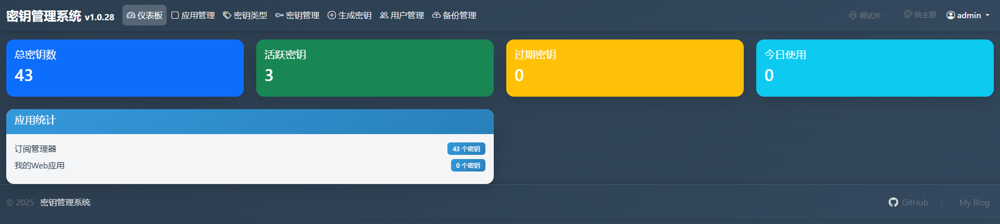
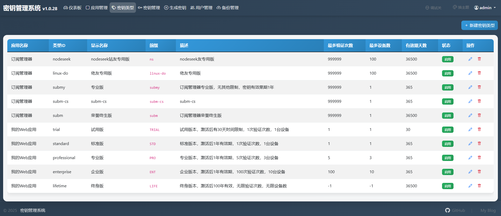
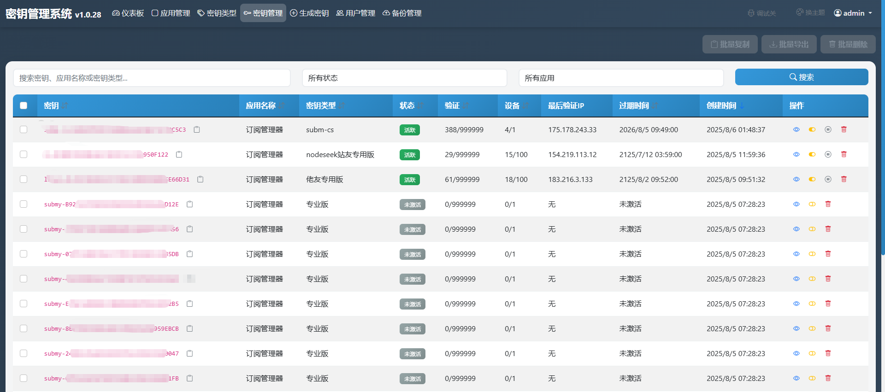
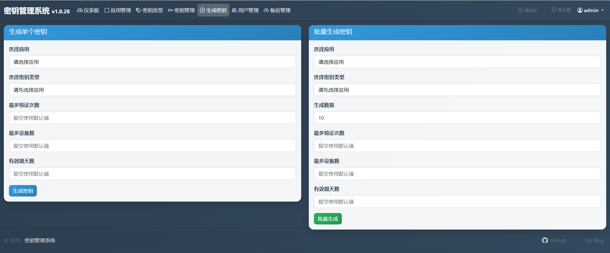
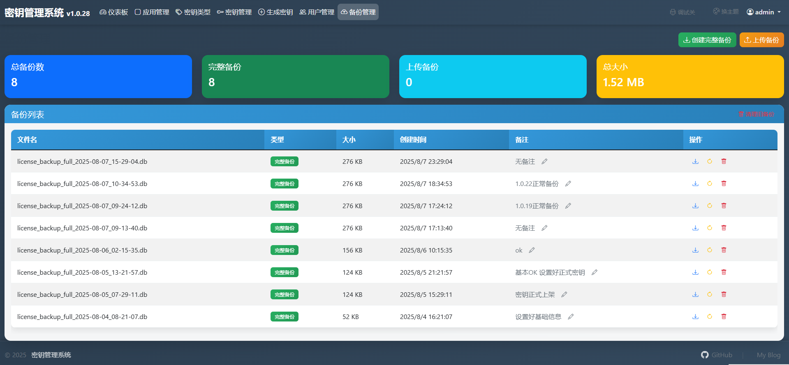

# 密钥管理系统 (License Management System)

## 系统特性

### 备份系统

### 相关链接

- 🌐 [项目主页](https://github.com/vbskycn/License)
- 📚 [在线文档](https://license.zhoujie8.cn/)
- 🐛 [问题反馈](https://github.com/vbskycn/License/issues)
- 🐳 [Docker镜像](https://hub.docker.com/r/zhoujie218/license-management-system)

---

**密钥管理系统** - 让License管理更简单、更高效！ 